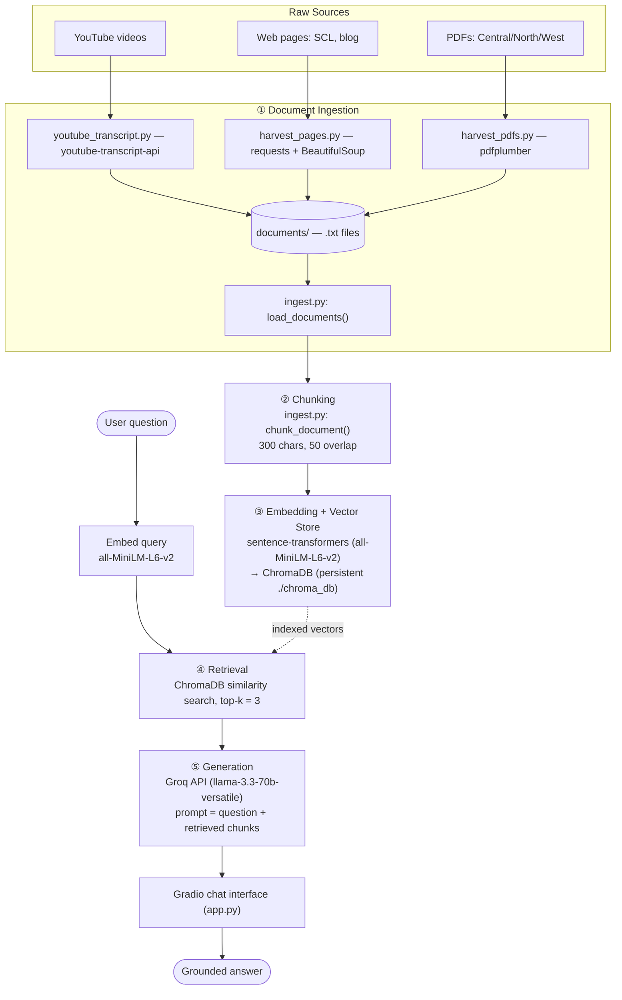

# Project 1 Planning: The Unofficial Guide

> Write this document before you write any pipeline code.
> Your spec and architecture diagram are what you'll use to direct AI tools (Claude, Copilot, etc.) to generate your implementation — the more specific they are, the more useful the generated code will be.
> Update the Retrieval Approach and Chunking Strategy sections if you change your approach during implementation.
> Update this file before starting any stretch features.

---

## Domain

<!-- What domain did you choose? Why is this knowledge valuable and hard to find through official channels? -->

I chose dining at Cornell University as my domain. This knowledge is valuable to those dining at Cornell, especially newly admitted students who are unfamiliar with the situation. This knowledge in some cases can be found on Cornell's official websites, but this isn't always the case: For instance, YouTube videos about rankings of dining places would normally require a user to watch through parts of the video to get the information and explanations they need, which can be time consuming as it requires finding the video and clicking around to the right moment in the video.

---

## Documents

<!-- List your specific sources: URLs, subreddit names, forum threads, or file descriptions.
     Aim for at least 10 sources that together cover different subtopics or perspectives within your domain. -->

| #   | Source           | Description                                                    | URL or location                                                                           |
| --- | ---------------- | -------------------------------------------------------------- | ----------------------------------------------------------------------------------------- |
| 1   | Blog             | Overview of food rankings across colleges and universities.    | https://www.collegetransitions.com/blog/best-college-food/                                |
| 2   | Official Website | Dining options in central Cornell campus.                      | https://now.dining.cornell.edu/eateries                                                   |
| 3   | YouTube Video    | Ranking of all Cornell restaurant options.                     | https://www.youtube.com/watch?v=oXL7lPaCTFQ                                               |
| 4   | YouTube Video    | Ranking of all places in Cornell for sweets.                   | https://www.youtube.com/watch?v=hR9lBcRT1pc                                               |
| 5   | YouTube Video    | Ranking of many places in the Finger Lakes region for food.    | https://www.youtube.com/watch?v=5qamJiAfKQI                                               |
| 6   | Official Website | A general guide to dining and dining options at Cornell.       | https://scl.cornell.edu/residential-life/dining/about-dining/guide-cornell-dining         |
| 7   | YouTube Video    | Ranking of many Ithaca dining options.                         | https://www.youtube.com/watch?v=v47vqblonJo                                               |
| 8   | Official Website | Dining options in north Cornell campus.                        | https://now.dining.cornell.edu/eateries                                                   |
| 9   | Official Website | Various meal plans for undergraduate students; includes costs. | https://scl.cornell.edu/residential-life/dining/meal-plans-rates/undergraduate-meal-plans |
| 10  | Official Website | Dining options in west Cornell campus.                         | https://now.dining.cornell.edu/eateries                                                   |

---

## Chunking Strategy

<!-- How will you split documents into chunks?
     State your chunk size (in tokens or characters), overlap size, and explain why those
     numbers fit the structure of your documents.
     A review-heavy corpus warrants different chunking than a long FAQ. -->

**Chunk size:** 300

**Overlap:** 50

**Reasoning:** Although the text files are of different formats, they all consist of a certain place and then a few sentences describing that place, so a constant chunk size should be able to successfully capture each place.
I'd know my chunks were too small if retrieval returned a fragment with a rating but no restaurant name (or a name with no verdict) — answers would be unanswerable or attached to the wrong place. I'd know they were too large if a single chunk spanned several restaurants, because the embedding would blur multiple places together and a query about one eatery would pull in unrelated neighbors, diluting precision. 300/50 is my starting point; if my five evaluation questions show name/verdict splits, I'd raise the overlap before changing chunk size.

---

## Retrieval Approach

<!-- Which embedding model are you using (e.g., all-MiniLM-L6-v2 via sentence-transformers)?
     How many chunks will you retrieve per query (top-k)?
     If you were deploying this for real users and cost wasn't a constraint, what tradeoffs
     would you weigh in choosing a different embedding model — context length, multilingual
     support, accuracy on domain-specific text, latency? -->

**Embedding model:** all-MiniLM-L6-v2 via sentence-transformers

**Top-k:** 3

**Production tradeoff reflection:** all-MiniLM-L6-v2 is a small, fast, free and local model. The tradeoff is retrieval accuracy on domain text vs. latency/storage

---

## Evaluation Plan

<!-- List your 5 test questions with their expected correct answers.
     Questions should be specific enough that you can judge whether the system's response
     is right or wrong. "What are good dining halls?" is too vague.
     "What do students say about wait times at [dining hall name] during lunch?" is testable. -->

| #   | Question                                                                          | Expected answer                                                     |
| --- | --------------------------------------------------------------------------------- | ------------------------------------------------------------------- |
| 1   | What is the cost of the Bear Choice meal plan for undergraduates over 1 semester? | $2,964                                                              |
| 2   | What is the Spotted Duck sweet place known for?                                   | It's known for ice cream flights where you can try a dozen flavors. |
| 3   | Which general region of the Cornell campus is Café Jennie located?                | It's located in the central part of campus.                         |
| 4   | Is Cornell considered to have better food than Rice University?                   | Yes.                                                                |
| 5   | Does Cornell provide reusable utensils? If so, where?                             | Yes. They are available to purchase at cafes.                       |

---

## Anticipated Challenges

<!-- What could go wrong? Name at least two specific risks with reasoning.
     Consider: noisy or inconsistent documents, missing source attribution, off-topic
     retrieval, chunks that split key information across boundaries. -->

1. best-college-food.txt ranks 25 colleges, and only #2 (Cornell) is on-topic. a query like "is the dining good?" can pull the wrong school.

2. The Central / North / West PDFs are a snapshot captured on "Sunday, June 7, 2026", which would get a misleading "Closed" that reflects one day.

---

## Architecture

<!-- Draw a diagram of your pipeline showing the five stages:
     Document Ingestion → Chunking → Embedding + Vector Store → Retrieval → Generation
     Label each stage with the tool or library you're using.
     You can use ASCII art, a Mermaid diagram, or embed a sketch as an image.
     You'll use this diagram as context when prompting AI tools to implement each stage. -->

---

## AI Tool Plan

<!-- For each part of the pipeline below, describe:
     - Which AI tool you plan to use (Claude, Copilot, ChatGPT, etc.)
     - What you'll give it as input (which sections of this planning.md, which requirements)
     - What you expect it to produce
     - How you'll verify the output matches your spec

     "I'll use AI to help me code" is not a plan.
     "I'll give Claude my Chunking Strategy section and ask it to implement chunk_text()
     with my specified chunk size and overlap" is a plan. -->

I will ask Claude Code to help me harvest web site.
I will use the starter project "ai201-lab1-rulesbot-starter" as base project, and ask Claude Code project;
I will ask ChatGPT on challenges and how to overcome.

**Milestone 3 — Ingestion and chunking:**

- **Tool:** Claude Code (in VS Code).
- **Input I give it:** my Documents table (the source URLs/PDFs) and my Chunking Strategy section (chunk size = 300 chars, overlap = 50). For harvesting I ask it to write several scripts rather than one generic scraper, because each source type needs a different approach.
- **What I expect it to produce:**
  1. Harvesting scripts that collect each source into a plain-text file in `documents/`:
     `youtube_transcript.py` (transcripts via `youtube-transcript-api`),
     `harvest_pages.py` (web pages via `requests` + BeautifulSoup, text only),
     `harvest_pdfs.py` (the Central/North/West PDFs via `pdfplumber`, with site nav/footer boilerplate stripped). Each file gets a `Name / Source` header so attribution survives into the chunks.
  2. The ingestion code in `ingest.py`: `load_documents()` reads every `.txt` in `documents/`, and `chunk_document()` applies my 300-char / 50-overlap sliding window, tagging each chunk with its source article and a unique `chunk_id`.
- **How I verify it matches my spec:** run `load_documents()` and confirm it loads the expected number of documents; then chunk everything and print ~5 representative chunks spread across the corpus to inspect them by hand. If I see noise (e.g. PDF navigation, icon-font glyphs) or split name/verdict pairs, I go back and either fix the harvest script or adjust overlap, then re-inspect.

**Milestone 4 — Embedding and retrieval:**

- **Tool:** Claude Code (in VS Code).
- **Input I give it:** my Retrieval Approach section — embedding model `all-MiniLM-L6-v2` via sentence-transformers, top-k = 3, cosine distance.
- **What I expect it to produce:** `retriever.py` with `embed_and_store()` (adds chunk text to a persistent ChromaDB collection, storing the source article as metadata) and `retrieve()` (embeds the query, runs a cosine similarity search, returns the top-k chunks with their text, source, and distance).
- **How I verify it matches my spec:** I wrote `eval_retrieval.py` to run 3 of my 5 evaluation questions through `retrieve()` and print the returned chunks with distance scores, then judge by hand whether each result is actually relevant.

  **Retrieval test results (3 of 5 eval queries):**

  | Query | Top distance | Relevant? | Notes |
  | --- | --- | --- | --- |
  | Bear Choice meal plan cost | 0.211 | ✅ | Top chunk literally contains "Bear Choice - $2,964 per semester" — the expected answer. |
  | What is the Spotted Duck known for? | 0.351 | ✅ | Top chunk: "known for these ice cream flights where you can try a dozen flavors" — matches expected answer. |
  | Which campus region is Café Jennie on? | 0.329 → **0.259** | ❌ → ✅ | **Initially failed**: the answer chunk says "The Cornell Store," never "central campus," so it didn't rank in the top 3. The geography was only in the source filename, not the chunk text the embedding sees. |

  **Fix applied:** the Café Jennie miss was a vocabulary gap — semantic search matched chunks that literally said "Central/North/West Campus" instead of the chunk naming the eatery. I updated `harvest_pdfs.py` to tag each eatery's name line with its campus (e.g. `Café Jennie 10:00am – 3:00pm (Central Campus)`), derived from the PDF filename, so the region rides into the embedding. After re-ingesting, the Café Jennie chunk became the **#1 result at distance 0.259** and now answers the question directly. This is the kind of name/attribute split my Anticipated Challenges and Chunking Strategy sections predicted.

**Milestone 5 — Generation and interface:**
